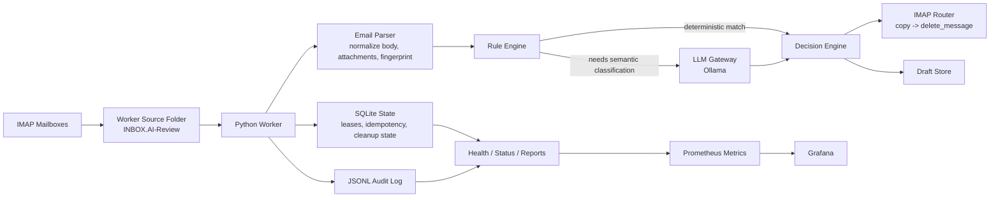

# mAIl

Local-first AI email triage for IMAP inboxes.

`mAIl` classifies incoming mail, routes it into operational folders, keeps an auditable workflow state in SQLite, and uses a local LLM only when deterministic rules are not enough. It is designed for private deployments where data residency, operational safety, and predictable routing matter more than raw demo speed.

## Why this project exists

Most inbox automation tools optimize for happy-path classification and ignore the hard parts:

- mailbox state drift
- IMAP safety during `copy -> delete`
- replay / deduplication
- partial failures after successful copy
- local-only processing and privacy
- auditability for every routing decision

`mAIl` was built to handle those constraints explicitly.

## What it does

- reads mail from worker-owned IMAP source folders such as `INBOX.AI-Review`
- applies deterministic rules first for billing, complaints, system mail, spam, newsletters, offers, and known operational patterns
- sends only ambiguous messages to a local Ollama model
- converts rule or LLM output into deterministic workflow actions
- routes mail to target folders like `INBOX.Billing`, `Junk`, `INBOX.Newsletter`, `INBOX.Offer`, `INBOX.Other`, `INBOX.Appointments`, or `INBOX.System`
- persists mailbox-safe workflow state and leases in SQLite
- writes JSONL audit logs for review, reporting, and Grafana / Prometheus metrics

Current folder policy:

- `spam -> Junk`
- `newsletter -> INBOX.Newsletter`
- `offer -> INBOX.Offer`
- `other -> INBOX.Other`
- `parse_error -> INBOX.AI-Uncertain`

Current confidence policy:

- high-signal categories use `MOVE_CONFIDENCE_THRESHOLD` (default `0.75`)
- `other` uses a lower `OTHER_MOVE_CONFIDENCE_THRESHOLD` (default `0.50`)
- this keeps genuinely low-signal mail out of `INBOX.AI-Uncertain` while preserving stricter routing for business-sensitive categories

## Architecture



## Request lifecycle

1. `launchd` starts the worker on a schedule.
2. The worker loads global settings and the mailbox manifest.
3. A global runtime lock is acquired.
4. Messages are fetched from the configured source folder.
5. Each message is parsed, normalized, and fingerprinted.
6. SQLite leases ensure idempotent processing and safe retries.
7. Deterministic rules handle obvious cases first.
8. Only unresolved messages go to Ollama for semantic classification.
9. The decision engine maps semantics to folders, flags, or drafts.
10. The message is routed through IMAP and every state transition is audited.

## Core design choices

### 1. Local-first AI

The LLM runs through Ollama on the host machine. This keeps message content local and removes dependency on external inference APIs for day-to-day classification.

### 2. Deterministic before probabilistic

The system does not ask the model to solve everything. It protects common operational classes with deterministic rules first, which improves speed, cost, and predictability.

### 3. Defensive IMAP

`mAIl` treats IMAP as a failure-prone integration point. It validates folder access, prefers `UID EXPUNGE` when possible, tracks `UIDVALIDITY`, and keeps explicit `cleanup_pending` state when copy succeeded but source deletion did not.

### 4. Stateful workflow, not stateless polling

SQLite is used for:

- leases
- idempotency
- retry control
- cleanup recovery
- mailbox-scoped uniqueness

This avoids duplicate work and allows safe replay after partial failures.

### 5. Auditable operations

Each routing action is written to JSONL audit logs, which then feed:

- health checks
- quality reports
- manual review reports
- Prometheus metrics

## Main components

| Component | Responsibility |
| --- | --- |
| `config.py` | Settings, mailbox manifest loading, secret resolution |
| `email_parser.py` | RFC822 parsing, body normalization, attachment metadata, fingerprint inputs |
| `rule_engine.py` | Fast deterministic routing for known categories |
| `llm_gateway.py` | Local semantic classification through Ollama with schema validation |
| `decision_engine.py` | Final workflow action and folder mapping |
| `imap_client.py` | Safe IMAP fetch/copy/delete/retry behavior |
| `state_manager.py` | SQLite workflow state, leases, cleanup tracking |
| `audit_logger.py` | Append-only JSONL audit trail |
| `metrics_exporter.py` / `metrics_bridge.py` | Prometheus-compatible runtime and quality metrics |
| `historical_backfill_cli.py` | Safe backlog staging through the standard worker flow |
| `admin_mailbox_cli.py` | Narrow operational remediation for exact IMAP/admin actions |
| `quality_learning_cli.py` | Read-only quality-learning report with proposed `rule_engine` / prompt / parser changes |

## Security and privacy

The public repository is prepared for safe sharing:

- real `.env` files are ignored
- real mailbox manifests are ignored
- runtime data, logs, drafts, and generated output are ignored
- only example configuration is kept in git

Runtime security model:

- prefer `imap_pass_ref` over plaintext `imap_pass`
- supported secret references:
  - `env:VAR_NAME`
  - `keychain:service/account`
  - `keychain:service:account`
- audit and state can redact direct PII fields
- runtime files are written with owner-only permissions where possible

## Quick start

### 1. Create the environment

```bash
python3 -m venv .venv
.venv/bin/pip install -r requirements.txt
.venv/bin/pip install -e .
```

### 2. Configure a local mailbox

Create `.env` from `.env.example` and fill in:

- `IMAP_HOST`
- `IMAP_USER`
- `IMAP_PASS`

Run:

```bash
.venv/bin/python -m mail_ai_agent.cli --json
```

### 3. Configure multi-mailbox mode

Start from:

- [config/mailboxes.example.json](config/mailboxes.example.json)

Prepare local files:

```bash
cp .env.multi.test.example .env.multi.test
cp config/mailboxes.example.json config/mailboxes.local.json
```

Then point `MAILBOXES_CONFIG_PATH` to that manifest and run:

```bash
.venv/bin/python -m mail_ai_agent.cli --env-file .env.multi.test --json
```

Preflight topology before enabling the worker:

```bash
.venv/bin/python -m mail_ai_agent.preflight_cli --env-file .env.multi.test
```

## Operational model

Production assumes:

- `INBOX.AI-Review` is worker-owned
- target folders already exist
- `Junk`, `INBOX.Newsletter`, and `INBOX.Offer` are provisioned before enabling production routing
- IMAP routing uses `copy -> delete_message`
- metrics are exposed to Prometheus and Grafana
- worker scheduling is handled by `launchd`

Useful commands:

```bash
.venv/bin/python -m mail_ai_agent.status_cli --state-db data/state.sqlite --audit-log logs/audit.jsonl
.venv/bin/python -m mail_ai_agent.report_cli --state-db data/state.sqlite --audit-log logs/audit.jsonl
.venv/bin/python -m mail_ai_agent.preflight_cli --env-file .env.multi.test
.venv/bin/python -m mail_ai_agent.cleanup_cli --apply
```

Safe reprocess of current uncertain backlog without deleting originals:

```bash
.venv/bin/python -m mail_ai_agent.historical_backfill_cli \
  --env-file .env.multi.prod \
  --apply \
  --keep-source \
  --force-reprocess \
  --folders INBOX.AI-Uncertain
```

Read-only quality-learning report:

```bash
.venv/bin/python -m mail_ai_agent.quality_learning_cli \
  --state-db data/multi-prod-state.sqlite \
  --audit-log logs/multi-prod-audit.jsonl \
  --output-dir logs/quality-learning
```

Review or apply a generated `rule_engine.py` patch:

```bash
.venv/bin/python -m mail_ai_agent.apply_quality_patch_cli \
  --patch logs/quality-learning/quality-learning-YYYYMMDDTHHMMSSZ-proposal-1.patch \
  --check
```

```bash
.venv/bin/python -m mail_ai_agent.apply_quality_patch_cli \
  --patch logs/quality-learning/quality-learning-YYYYMMDDTHHMMSSZ-proposal-1.patch \
  --apply
```

Historical audit cleanup after category model changes:

```bash
.venv/bin/python -m mail_ai_agent.migrate_audit_log_cli \
  --audit-log logs/multi-prod-audit.jsonl
```

Apply with automatic backup:

```bash
.venv/bin/python -m mail_ai_agent.migrate_audit_log_cli \
  --audit-log logs/multi-prod-audit.jsonl \
  --apply
```

Historical backlog staging:

```bash
.venv/bin/python -m mail_ai_agent.historical_backfill_cli \
  --env-file .env.multi.prod \
  --export-csv output/historical-backfill-plan.csv
```

Targeted remediation:

```bash
.venv/bin/python -m mail_ai_agent.admin_mailbox_cli \
  --env-file .env.multi.prod \
  requeue-uncertain
```

## Monitoring

The project exposes Prometheus-style metrics and is designed to integrate with Grafana.

Example checks:

```bash
bash scripts/prod_metrics.sh
curl -sS http://127.0.0.1:9177/metrics | sed -n '1,80p'
curl -sS 'http://127.0.0.1:9090/api/v1/query?query=mailai_health_ok'
```

## Documentation

Active documentation:

- [docs/architecture.md](docs/architecture.md)
- [docs/launchd-setup.md](docs/launchd-setup.md)
- [docs/multi-mailbox-operations.md](docs/multi-mailbox-operations.md)
- [docs/recovery-runbook.md](docs/recovery-runbook.md)
- [docs/quality-review-checklist.md](docs/quality-review-checklist.md)

Historical reference:

- [docs/uncertain-remediation-2026-03-31.md](docs/uncertain-remediation-2026-03-31.md)

## Tests

Primary local test runner (recommended for this repo):

```bash
uv run python -m pytest tests/
```

Equivalent shortcut:

```bash
make test
```

Run the live Ollama integration test:

```bash
RUN_LIVE_OLLAMA_TESTS=1 .venv/bin/pytest tests/integration/test_ollama_live.py -q
```

Run the live IMAP integration test:

```bash
RUN_LIVE_IMAP_TESTS=1 \
LIVE_IMAP_HOST=mail.example.com \
LIVE_IMAP_USER=user@example.com \
LIVE_IMAP_PASS=change-me \
LIVE_IMAP_SOURCE_FOLDER=INBOX.Test-AI-Review \
.venv/bin/pytest tests/integration/test_imap_live.py -q
```

Do not point live IMAP tests at a production source folder.

## AI Branch Sweep

Discovery/review report for AI-generated branches and open PR heads:

```bash
make ai-branch-sweep
```

Delete only patch-duplicate AI branches that have no open PR:

```bash
make ai-branch-sweep-clean
```

## Status

The runtime and operational hardening pass is complete. The next recommended stage is quality iteration:

- promote repeated safe LLM decisions into deterministic rules
- expand the golden set with anonymized production-like examples
- monitor category quality and model drift
- keep operational changes auditable and reversible
